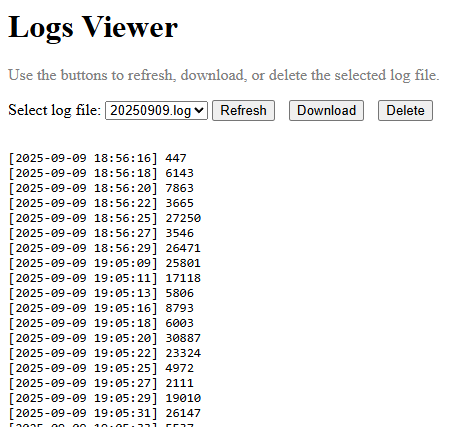

# http-log-receiver

簡單的 HTTP POST 日誌伺服器，可將收到的訊息記錄到每日檔案，並提供網頁介面查看、下載或刪除日誌。

A simple HTTP POST log server that records incoming messages to daily log files and provides a web interface to view, download, or delete logs.

## Environment Setup

```
sudo apt install -y python-is-python3 python3-pip
sudo mv /usr/lib/python3.12/EXTERNALLY-MANAGED /usr/lib/python3.12/EXTERNALLY-MANAGED.bak
pip install flask
```

## Running the Log Server

Test locally:

```
python http_log_server.py
```

Install as a systemd service:

```
sudo cp http_log_server.service /usr/lib/systemd/system/
sudo systemctl daemon-reload
sudo systemctl start http_log_server.service
sudo systemctl status http_log_server.service
● http_log_server.service - A Simple HTTP Log Server
     Loaded: loaded (/usr/lib/systemd/system/http_log_server.service; disabled; preset: enabled)
     Active: active (running) since Tue 2025-09-09 19:21:54 CST; 1s ago
   Main PID: 10564 (python3)
      Tasks: 1 (limit: 4389)
     Memory: 19.9M (peak: 20.1M)
        CPU: 483ms
     CGroup: /system.slice/http_log_server.service
             └─10564 /usr/bin/python3 /home/browan/http_log_server.py
```


## Test Commands

Client:

```bash
while true; do \
	curl -X POST http://<ipaddr>:8080/testlog -H "Content-Type: text/plain" --data "$(echo $RANDOM)"; \
	sleep 2; \
done
```

Server:

```
$ python http_log_server.py
 * Serving Flask app 'http_log_server'
 * Debug mode: off
[2025-09-09 19:14:57] 4865
[2025-09-09 19:14:59] 19284
[2025-09-09 19:15:01] 2155
[2025-09-09 19:15:03] 5983
[2025-09-09 19:15:06] 18048
```


## Viewing Logs

Open in a browser:

```
http://<ipaddr>:8080/logs
```

